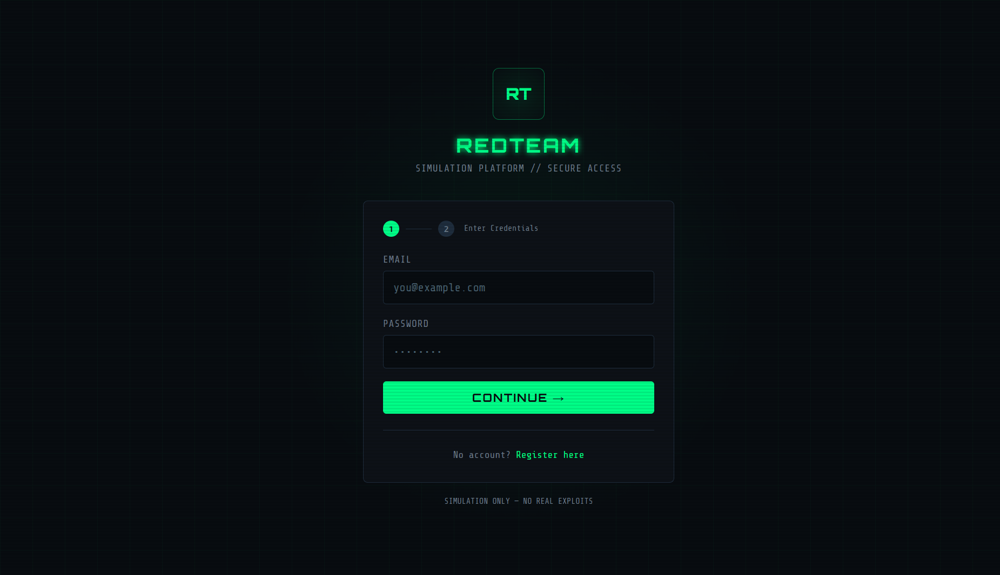
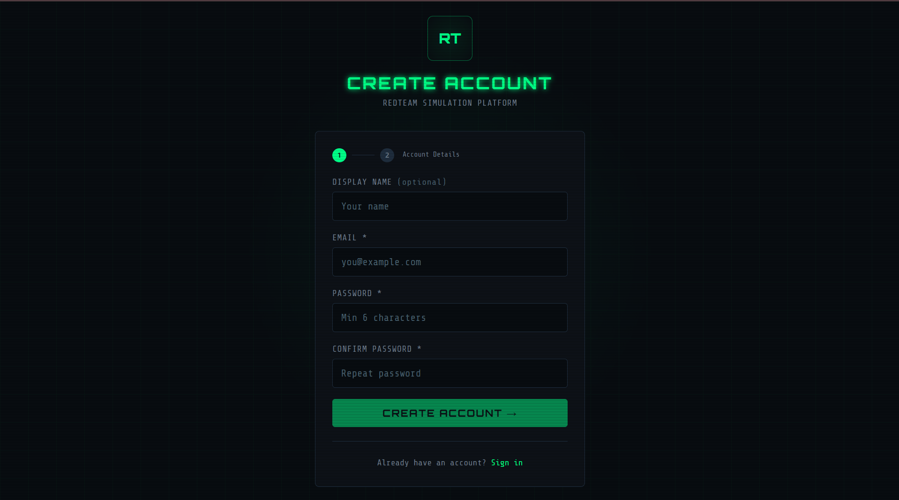
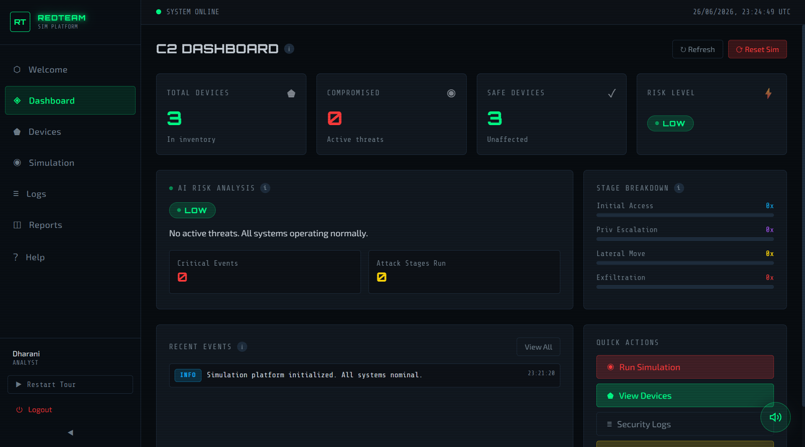
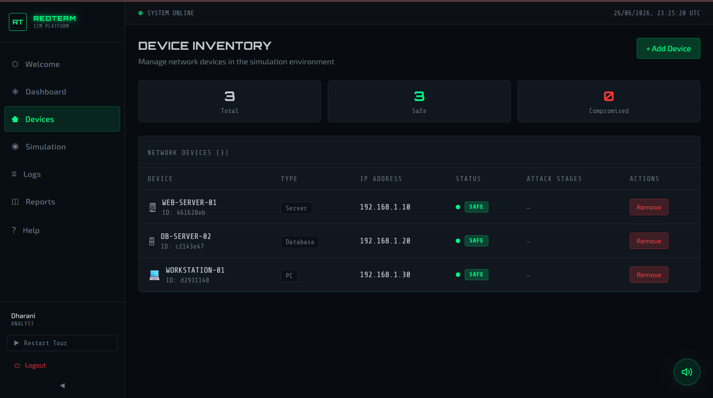
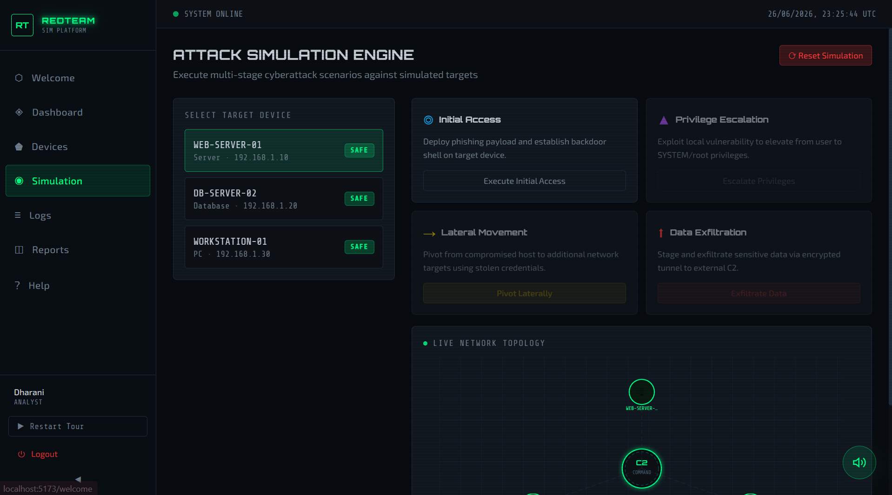
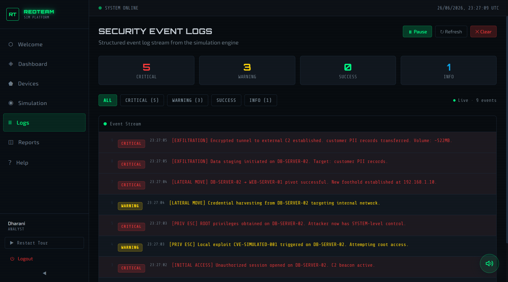
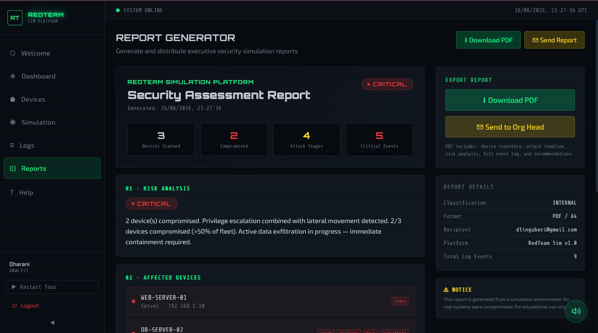
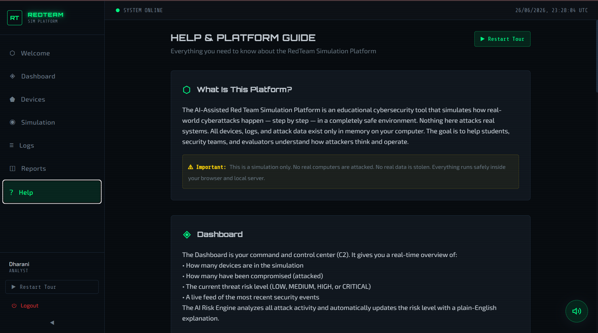
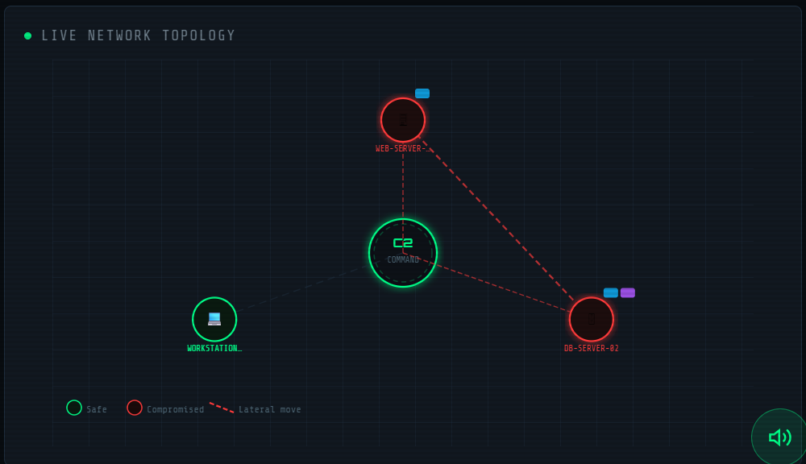
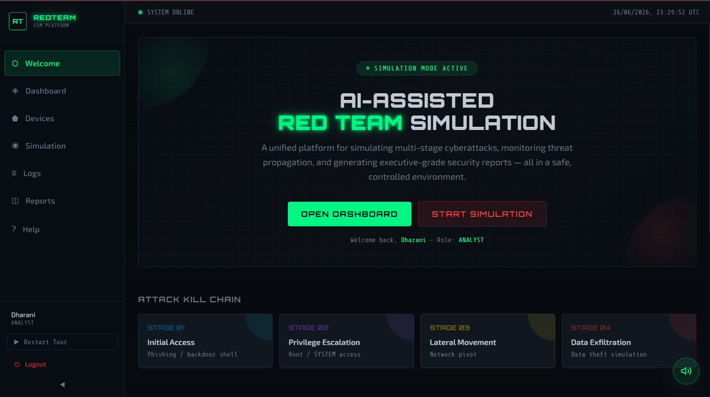

# 🔴 AI-Assisted Red Team Simulation Platform

An interactive full-stack cybersecurity platform that demonstrates the **Cyber Attack Kill Chain** in a safe, educational, and visual environment.

> **Educational Use Only:** This project is intended for cybersecurity education, research, portfolio demonstrations, and hackathons. It does **not** attack real systems or perform unauthorized activities.

---

## 🚀 Features

- 🔐 User Registration & Login
- 📧 Email OTP Verification
- 🔑 JWT Authentication
- 🛡️ Password Hashing (bcrypt)
- 💻 Device Management
- ⚔️ Attack Kill Chain Simulation
  - Initial Access
  - Privilege Escalation
  - Lateral Movement
  - Data Exfiltration
- 🤖 AI-Based Risk Analysis
- 🌐 Interactive Network Topology
- 📊 Live Security Event Logs
- 📄 PDF Report Generation
- 🔊 Interactive Sound Effects
- 🎓 Guided Tour & Help Page

---

## 🛠️ Tech Stack

### Frontend
- React.js
- Vite
- Tailwind CSS
- Axios
- jsPDF

### Backend
- Node.js
- Express.js
- JWT
- bcrypt
- Nodemailer

---

## 📂 Project Structure

```text
AI_RT/
│
├── backend/
│   ├── controllers/
│   ├── middleware/
│   ├── routes/
│   ├── utils/
│   ├── server.js
│   └── package.json
│
├── frontend/
│   ├── src/
│   │   ├── api/
│   │   ├── components/
│   │   ├── hooks/
│   │   ├── pages/
│   │   └── utils/
│   └── package.json
│
├── screenshots/
│   ├── login.png
│   ├── register.png
│   ├── dashboard.png
│   ├── devices.png
│   ├── simulation.png
│   ├── logs.png
│   ├── reports.png
│   ├── help.png
│   ├── network-topology.png
│   └── home.png
│
├── README.md
├── LICENSE
├── CONTRIBUTING.md
├── SECURITY.md
├── CODE_OF_CONDUCT.md
├── .gitignore
└── .env.example
```

---

# 📸 Screenshots

| Login | Register |
|-------|----------|
|  |  |

| Dashboard | Devices |
|-----------|---------|
|  |  |

| Simulation | Security Logs |
|------------|---------------|
|  |  |

| Reports | Help |
|---------|------|
|  |  |

| Network Topology | Home |
|------------------|------|
|  |  |

---

## ⚙️ Installation

### Clone the Repository

```bash
git clone https://github.com/linguberidharani/AI_RT.git
```

> Replace `AI_RT` with your actual repository name if it is different.

### Backend

```bash
cd backend
npm install
npm start
```

### Frontend

```bash
cd frontend
npm install
npm run dev
```

Backend:
```
http://localhost:5000
```

Frontend:
```
http://localhost:5173
```

---

## 🔑 Environment Variables

Create a `.env` file inside the **backend** folder.

```env
PORT=5000
JWT_SECRET=your_jwt_secret
EMAIL_USER=your_email@gmail.com
EMAIL_PASS=your_app_password
CLIENT_URL=http://localhost:5173
```

---

## 📈 Future Enhancements

- Docker Support
- Database Integration
- WebSocket Live Updates
- MITRE ATT&CK Mapping
- Cloud Deployment
- AI Attack Recommendations

---

## 🤝 Contributing

Contributions are welcome. Please read **CONTRIBUTING.md** before submitting a Pull Request.

---

## 📄 License

This project is licensed under the **MIT License**.

See the **LICENSE** file for details.

---

## 👩‍💻 Author

**Dharani Linguberi**

**B.Tech – Information Technology**

Cybersecurity Enthusiast

**GitHub:** https://github.com/linguberidharani

**LinkedIn:** https://www.linkedin.com/in/dharani-linguberi-707528394/

---

## ⭐ Support

If you found this project useful:

- ⭐ Star this repository
- 🍴 Fork this repository
- 🐞 Report Issues
- 💡 Suggest Features

Happy Coding! 🚀
